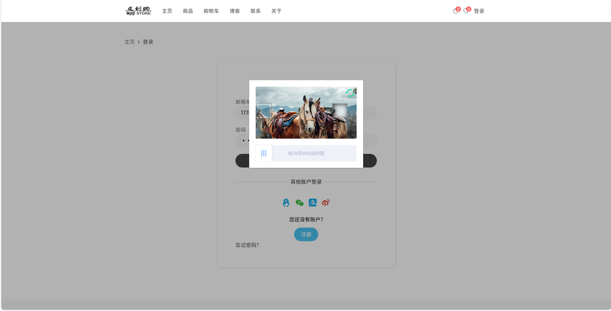
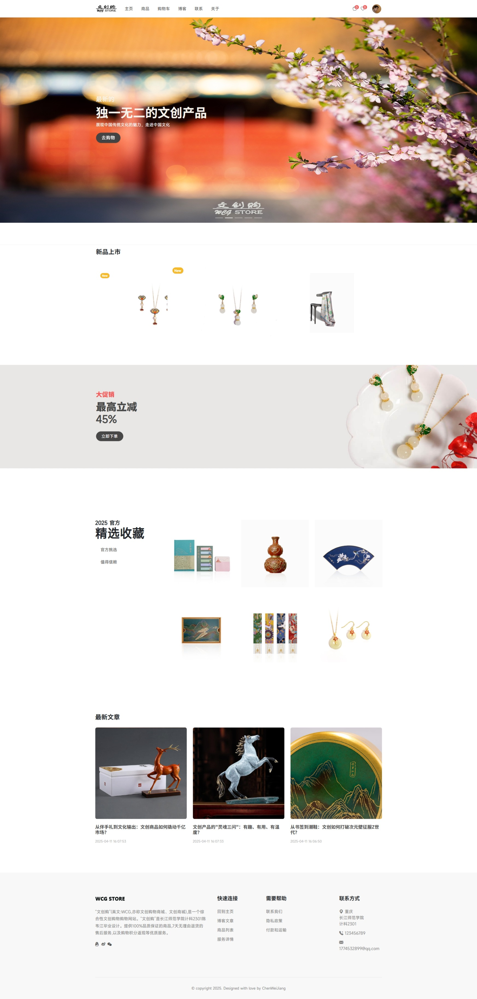
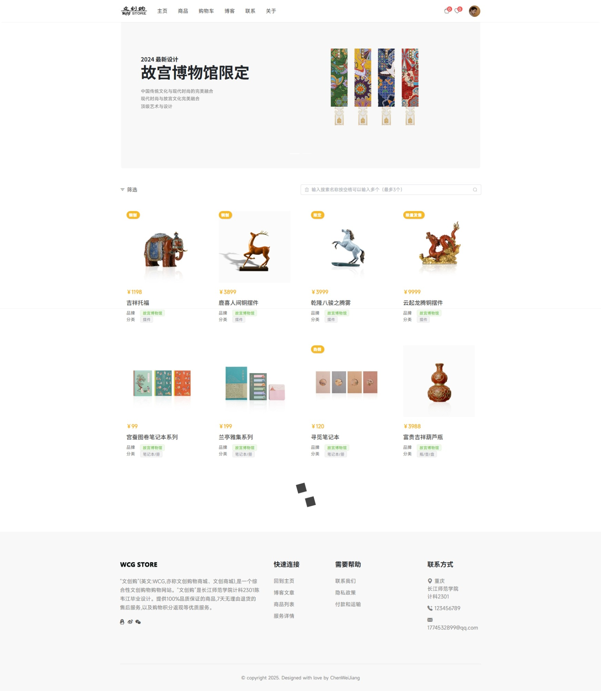
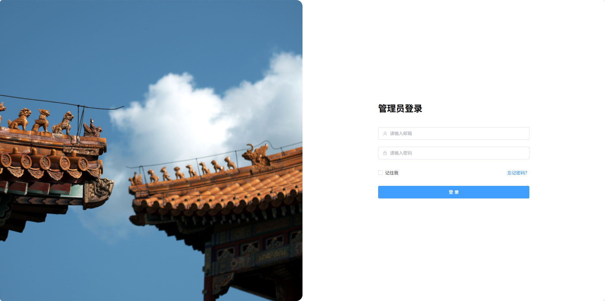
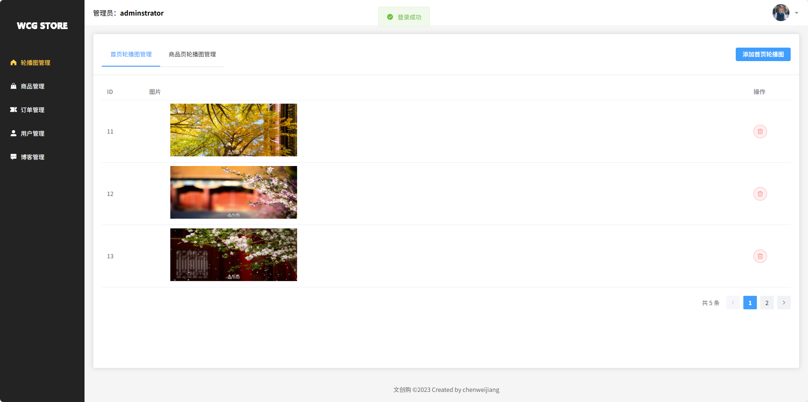

# WCG Mall 电商系统
这个项目是之前写的，写得很乱，前端后端都很乱，不过功能是没什么大问题，精力有限，现在正在缓慢的重构
## 🎯 项目演示
### 演示账户
项目链接  https://wcgmall-web.wcgmallcwj.online/login
- **用户端**：
  - 邮箱：1774532899@qq.com
  - 密码：123456

## 📷 系统截图

### 用户端截图





### 管理端截图




更多截图在run-images目录下，或者访问https://wcgmall-web.wcgmallcwj.online/ 查看运行效果


## 📖 项目简介

WCG Mall是一个功能完善的全栈电商系统，采用前后端分离架构，包含三个主要组件：
- **后端服务**：基于Spring Boot的RESTful API服务
- **用户前端**：基于Vue 3的用户商城界面
- **管理前端**：基于Vue 3的后台管理系统

系统实现了用户管理、商品管理、订单处理、购物车、心愿单、博客、评论、支付及WebSocket实时通信等完整的电商功能链路。

## 🛠 技术栈

### 后端技术栈
- **Spring Boot 3.1.2**：提供自动配置、依赖注入等核心功能
- **MyBatis Plus**：简化数据库操作
- **Redis**：用于缓存和会话管理
- **MySQL**：关系型数据库存储
- **JWT**：无状态身份验证
- **RSA**：数据加密
- **支付宝API**：支付集成
- **Swagger UI**：API文档和调试

### 前端技术栈
- **Vue 3**：渐进式JavaScript框架
- **Vite**：现代前端构建工具
- **Pinia**：状态管理
- **Vue Router**：路由管理
- **Element Plus**：UI组件库
- **Bootstrap**：响应式布局
- **Axios**：HTTP客户端

## 📁 项目结构

```
mall/
├── vue-wcg-mall-admin/  # 管理端前端项目
├── vue-wcg-mall-user/   # 用户端前端项目
└── wcg_mall/            # Spring Boot后端项目
```

## 📱 系统功能

### 核心功能模块

#### 用户管理
- 登录 / 注册 / 登出
- 邮件激活
- 密码重置
- 用户信息更新
- 文件上传

#### 商品管理
- 商品列表 / 搜索 / 筛选
- 商品详情
- 添加 / 修改 / 删除商品
- 商品上下架
- 商品库存管理

#### 订单管理
- 订单创建
- 支付（集成支付宝）
- 退款
- 订单发货
- 订单详情查看
- 用户确认收货 / 取消订单

#### 购物车与心愿单
- 添加 / 删除 / 修改购物车商品
- 购物车商品转心愿单
- 心愿单商品转购物车
- 心愿单管理

#### 博客与评论
- 博客发布 / 编辑 / 删除
- 获取博客列表 / 热门博客 / 最新博客
- 评论发表 / 删除 / 查询

### 用户端功能
- 首页展示
- 商品浏览与搜索
- 购物车管理
- 订单管理
- 个人中心
- 博客阅读

### 管理端功能
- 商品管理
- 订单管理
- 用户管理
- 博客管理
- 系统配置

## 🚀 快速开始

### 环境要求
- JDK 17+
- MySQL 8.0+
- Redis 5.0+
- Node.js 16+
- Maven 3.8+

### 安装与运行

#### 1. 数据库准备

```bash
# 创建数据库并导入脚本
mysql -u root -p < wcg_mall/db.sql
```

#### 2. 配置文件修改

修改后端项目中的数据库连接配置：
```properties
# wcg_mall/src/main/resources/application.properties
spring.datasource.url=jdbc:mysql://localhost:3306/wcg_mall?useUnicode=true&characterEncoding=utf-8&useSSL=false
spring.datasource.username=root
spring.datasource.password=your_password
```

#### 3. 启动后端服务

运行后端项目：

WcgMallApplication.java


#### 4. 启动用户端

```bash
cd vue-wcg-mall-user
npm install
npm run dev
```

#### 5. 启动管理端

```bash
cd vue-wcg-mall-admin
npm install
npm run dev
```

### 访问地址
- **后端API文档**：http://localhost:1203/doc.html
- **用户端**：http://localhost:3000
- **管理端**：http://localhost:3001

## 📊 项目亮点

1. **完整的电商生态**：涵盖从商品浏览到订单支付的全流程
2. **双端设计**：用户端和管理端分离，职责明确
3. **安全机制**：JWT认证、RSA加密、密码安全存储
4. **性能优化**：Redis缓存、分页查询、懒加载
5. **用户体验**：响应式设计、动画效果、实时反馈
6. **完整的文档**：Swagger UI接口文档，便于调试和扩展

## 📝 开发指南

### API文档
后端API已集成Swagger UI，启动服务后可通过以下地址访问：
http://localhost:1203/doc.html


## 🔮 未来规划

1. 引入Elasticsearch提升搜索性能
2. 集成更多支付方式
3. 添加推荐系统
4. 优化移动端体验
5. 引入消息队列处理异步任务
6. 增加数据分析与统计功能

## 🤝 贡献指南

欢迎提交Issue和Pull Request！

## 📄 许可证

MIT License

## 📧 联系我们

如有问题或建议，请联系：
- 邮箱：1774532899@qq.com
---

感谢您使用WCG Mall电商系统！如果您觉得这个项目有帮助，请给我们Star支持！⭐


