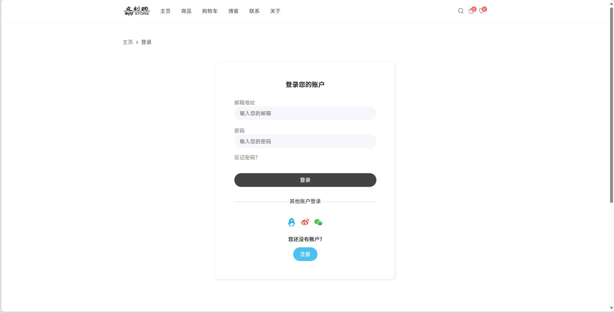
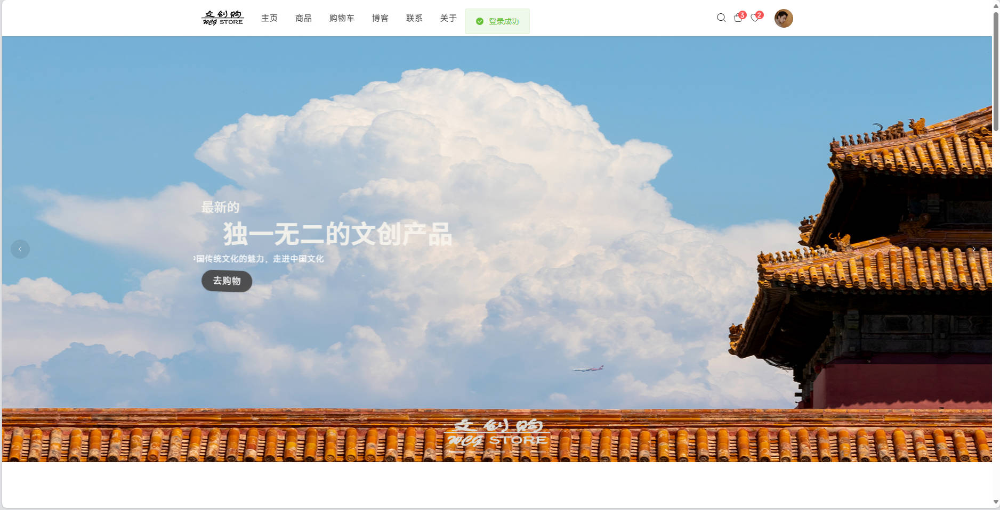
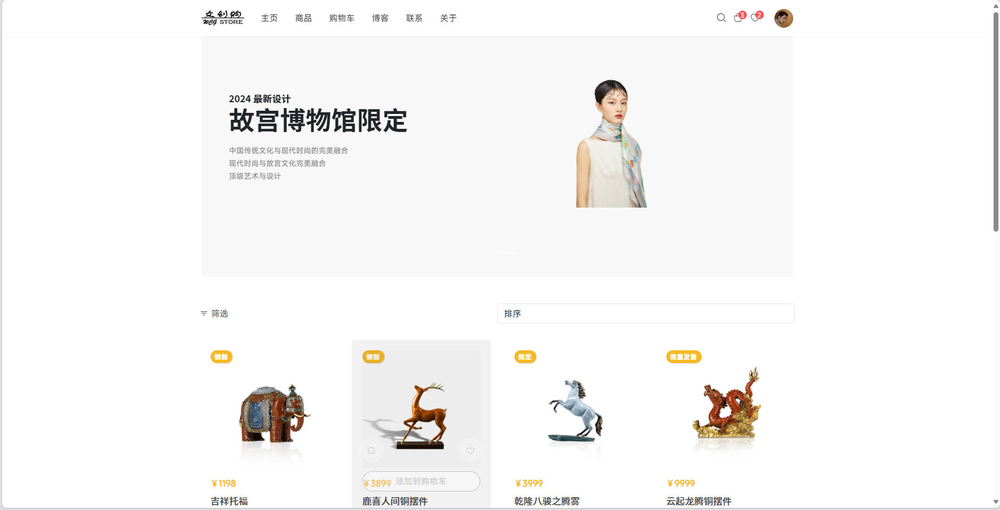
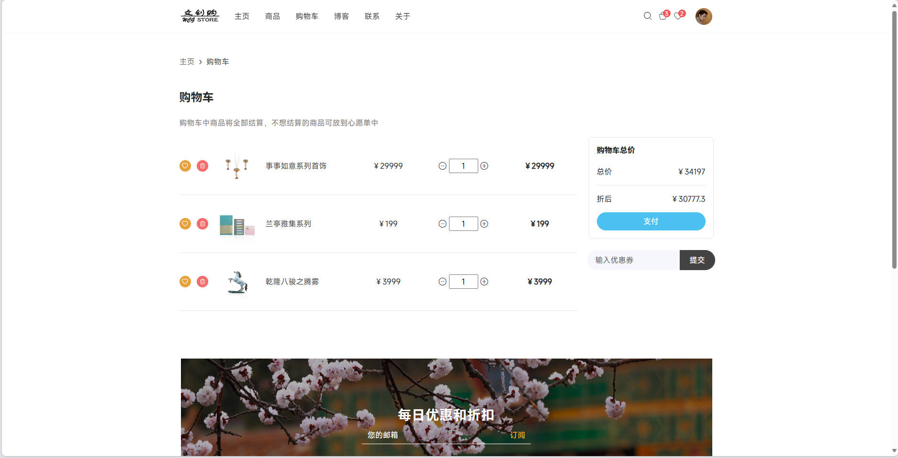
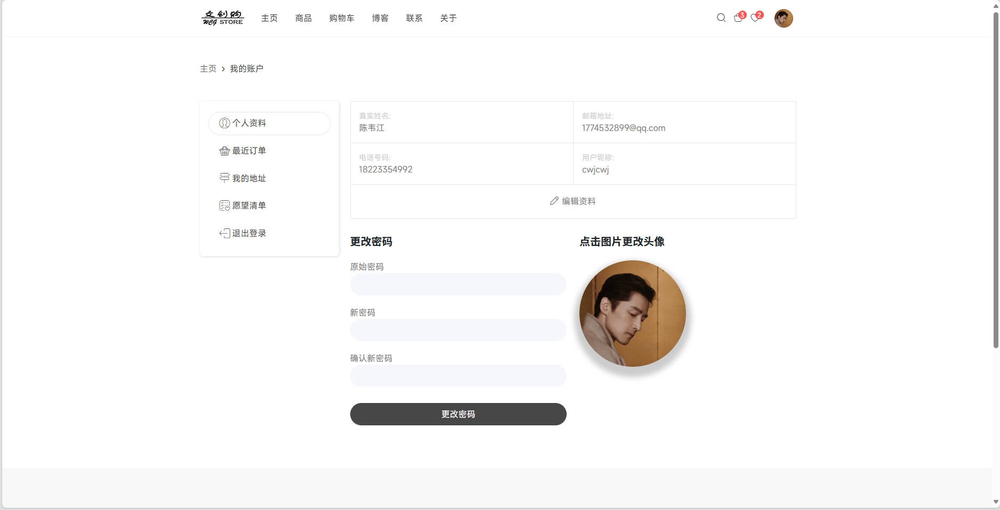

文创购物商城，采用SpringBoot3 + MybatisPlus + Redis + Vue3 + ElementPlus，前后端分离系统实现支付宝沙盒付款功能，文件上传到阿里巴巴对象存储服务等。自己部署时请更改邮箱服务、阿里云OSS、支付宝支付、百度地图等为自己的。

访问  http://wcgmallcwj.online     查看效果，账户自己使用邮箱注册即可

前端代码：https://gitee.com/CWJ991203/vue-wcg-mall-user

后台管理代码：https://gitee.com/CWJ991203/vue-wcg-mall-admin

部分效果如下

